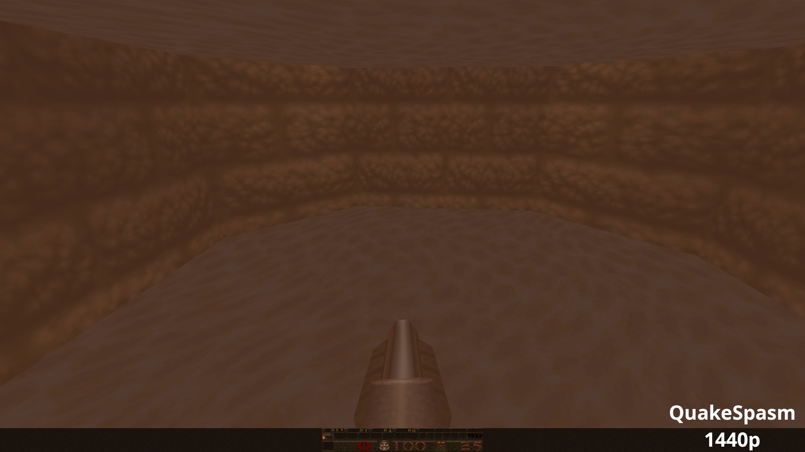

# ChadQuake
ChadQuake is a fork of [Mark V Quake](http://quakeone.com/markv/) version 1036 with some changes to make it more similar to the original version of Quake.

### Software rendering only
WinQuake, baby! Because that's how Quake was meant to be played! No texture filtering, no texture perspective correction, awesome [fluid effects](https://fdossena.com/?p=quakeFluids/i.md), better lighting, and more. For a complete comparison between Software Quake and GLQuake, see [this article](https://www.quaddicted.com/engines/software_vs_glquake).
Code for other versions is still there, but it's untested and the build config has been removed.

### No animation interpolation
Choppy animations and movements are part of Quake, and they look better than interpolated ones that look like what a 12 year old would make in an evening playing around with Unity.

### Quake defaults, while keeping support for mods
All the customization is hidden so that it can only be accessed by mods or the console. This keeps the original look and feel of the game, as well as support for all the mods that work with Mark V.

### MP3 music only
It's 2022, Chad doesn't have a CD drive, why even support it? Music is only read from MP3 files instead.

### Windows and Linux support
The new version of ChadQuake (re)introduced Linux support because GNU/Linux is the new OS of choice for any self-respecting Chad.

### No level selection menu
Chad plays through the whole game on nightmare, he doesn't cheat with the level selector.

### The original menu
Mouse support for menus in a 1996 game? Heresy!

### Max resolution is 1280x1024
Do you think a 1996 game was meant to be played in 4K? Or even 1080p? Heresy! You play in 640x480 and thank your daddy for buying you that sweet Pentium Pro, otherwise you'd be stuck at 320x200 like everyone else. For mods support however, it's better to have a limit of 1280x1024.

The new version of ChadQuake improved the original integer scaling option and can now run at your native screen resolution (yes, even 4K), while still rendering internally at a lower resolution and then scaling it using integer scaling. For instance, let's say you have a 2560x1440 display, and you set the scaling to 640x480, ChadQuake will render at 853x480 and then do 3x integer upscaling to bring it up to 2560x1440, keeping that nice pixelated crispy and crunchy look that we crave for.

For an even more 1996 experience, open the console and try `r_limitspeed 1`, it simulates the performance of an old PC, with performance going up and down depending on scene complexity!

### Widescreen support
Yes, the original Quake ACTUALLY DID support wide displays, as well as tall ones, square ones, any aspect ratio was supported. So does the new version of ChadQuake.

Needless to say, Chad plays EXCLUSIVELY on a 4:3 CRT.

### Various improvements and bug fixes over Mark V 1036
* Support for GCC version 10 on Linux
* Fullscreen now works on Linux
* Implemented MP3 music support on Linux
* Introduced an `r_limitspeed` cvar to reduce the framerate based on estimated scene complexity, for those who REALLY want the 1996 experience
* Improved integer scaling behavior (can render at up to 1280x1024 while keeping native resolution)
* Fixed a bug that would break the game when reloading a save while dead

## How to use ChadQuake
It works the same as Mark V:
* Copy the `id1` folder from the original game, there should only be two files in it: `pak0.pak` and `pak1.pak`, delete anything else
* Put your music files in `id1/music` named `track##.mp3`
* Run the game

Note: on GNU/Linux, you'll need the sdl2 and sdl2_mixer libraries, download them using your package manager.

## Building
On Windows, ChadQuake can be built on Visual Studio 2008 SP1. Load the project and press Build.

On GNU/Linux, ChadQuake can be build with Code::Blocks IDE. Load the project, choose between Debug and Release and build it. The original code has been updated to support GCC 10 and newer.

## Credits
Baker: for making Mark V, the best and most badass Quake source port out there.

## Screenshots
The following screenshots show a comparison between ChadQuake and QuakeSpasm, another (great) source port.

## License
Copyright (C) 2018-2022 Federico Dossena

This program is free software: you can redistribute it and/or modify
it under the terms of the GNU General Public License as published by
the Free Software Foundation, either version 3 of the License, or
(at your option) any later version.

This program is distributed in the hope that it will be useful,
but WITHOUT ANY WARRANTY; without even the implied warranty of
MERCHANTABILITY or FITNESS FOR A PARTICULAR PURPOSE.  See the
GNU General Public License for more details.

You should have received a copy of the GNU General Public License
along with this program.  If not, see <http://www.gnu.org/licenses/>.
